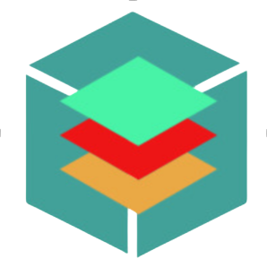

<link rel="stylesheet" href="https://use.fontawesome.com/releases/v5.6.1/css/all.css" integrity="sha384-gfdkjb5BdAXd+lj+gudLWI+BXq4IuLW5IT+brZEZsLFm++aCMlF1V92rMkPaX4PP" crossorigin="anonymous">

    
    <h2 style="font-weight: bold">Bui Minh Tri</h2>
    

    
    

 

# 🇻🇳 About Me
A passionate software developer with a keen interest in Artificial Intelligence.

- Hands-on experience in IT
- Normally use either Mac Mini or Raspberry Pi 5 to work on my projects
- Created Discord Bots to enhance users' experiences
- Worked on AI and Data projects

Eager to expand my knowledge and skills, I am seeking opportunities at institutions that prioritize innovation and embrace the latest technological advancements.

I'm currently researching about Inter-connected Neural Networks (IcNNs), a new cognitive framework that expands beyond Artificial Intelligence. This neural network is planned to be the successor to Artificial Superintelligence (ASI), opening new researches towards:
- Self-Governance Intelligence (SGI): Where neural networks learn to govern by themselves and gain conciousness
- Conscious-Coordinated Intelligence (CCI): The next successor of SGI where neural networks can interoperate with one another with different and contrasting unique conscience
---

## ‍💻 Known Coding Languages and Tools

    &nbsp;
    &nbsp;
    &nbsp;
    &nbsp;
    &nbsp;
    &nbsp;
    &nbsp;
    &nbsp;

---

## 🔥 My Statistics

