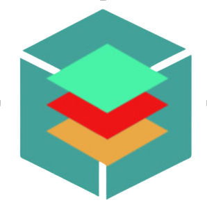

<link rel="stylesheet" href="https://use.fontawesome.com/releases/v5.6.1/css/all.css" integrity="sha384-gfdkjb5BdAXd+lj+gudLWI+BXq4IuLW5IT+brZEZsLFm++aCMlF1V92rMkPaX4PP" crossorigin="anonymous">

    
    <h2 style="font-weight: bold">Joseph Bui Minh Tri</h2>
    

    
    
     
    
    

 

# 🇸🇬 About Me
A passionate software developer with a keen interest in Artificial Intelligence.

- Hands-on experience in IT
- Likes to code and build robots
- Joined the course "Introduction to AI and Machine Learning on Google Cloud" to have a solid foundation in AI
- Helped in-charge of Logistics for my CCA
- Created Discord Bots to enhance users' experiences
- Worked on AI and Data projects such as RAG, predictive projects and the Steam games dashboard
- Currently working on a C++ Neural Network project and a game called Wavecore (coming soon)

Eager to expand my knowledge and skills, I am seeking opportunities at institutions that prioritize innovation and embrace the latest technological advancements.

---

## ‍💻 Known Coding Languages and Tools

  &nbsp;
  &nbsp;
  &nbsp;
  &nbsp;
  &nbsp;
  &nbsp;
  &nbsp;

---

## 🏆 Awards (School-based)
- Young Engineer Award (Applied Learning) by Singapore Polytechnic
- 1st Place in Drone Programming (STEM ALP Day) by Serangoon Secondary School
- Bronze Award in Singapore Math Kangaroo Contest (SMKC) 2024 at Secondary 4/Grade 10
- Honorable Mention in Singapore Math Kangaroo Contest (SMKC) 2022 at Secondary 2/Grade 8

---

## 🧾 Certificates (School-based and Competitions)
- Singapore Math Kangaroo Contest (SMKC) 2023 at Secondary 3/Grade 9
- Drone Odyssey Challenge 2023
- STEM Playground 2023 Challenge 1 "Canbridge Hold'em" 2023 at Secondary 3
- Robomaster 2022 Drone Tournament Singapore Site Secondary Category
- 2022 Singapore IDE Sprint (Secondary)
- 2021 Singapore IDE Robotics - Secondary Category
- September 2021 StrITwise Edge of Automation

---

## 🧾 Certificates (Online)
- Java Master Class
- CS101 - Introduction to Computer Science with Python

---

## 🎓 Courses Attended
- Introduction to AI and Machine Learning on Google Cloud (Summer 2023)
- "I can be a Technopreneur" by Singapore Polytechnic (Spring 2023)
- Java Master Class by Amigoscode (Fall 2022)
- Java Essentials by Amigoscode (Summer 2022)
- Terminal, Bash and VIM Essentials by Amigoscode (Summer 2022)
- CS102 - Conquer the magical STEAMvalley with PyGame (Spring 2022)
- CS201 - Introduction to Robotics Programming with VEX (Fall 2021)
- CS101 - Introduction to Computer Science with Python by STEAM for Vietnam (Spring 2021)

---

## 🔥 My Statistics

